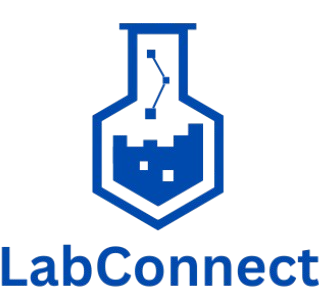

<!-- PROJECT SHIELDS -->

[![Contributors][contributors-shield]][contributors-url]
[![Forks][forks-shield]][forks-url]
[![Issues][issues-shield]][issues-url]
[![Pull Requst][pr-shield]][pr-url]
[![Activity][activity-shield]][activity-url]
[![Stargazers][stars-shield]][stars-url]


<!-- TABLE OF CONTENTS -->
<details>
    <summary> Table of Contents </summary>
    <ol>
        <li>
            <a href="#about"> About the project</a>
            <ul>
                <li><a href="#built-with">Built With</a>
            </ul>
        </li>
        <li>
            <a href="#prerequisites"> Prerequisites</a>
        </li>
        <li>
            <a href="#installation"> Installation</a>
        </li>
    </ol>
</details>


<!-- ABOUT THE PROJECT -->
## About
<div align="center">
    <a href="https://github.com/LabConnect-RCOS/LabConnect-Frontend">
<!--  -->
</a>


<br>

<p align="center">A centralized website to connect RPI undergraduate students with research or lab positions<br>
posted by professors, graduate students, or lab staff.</p>
</div>


### Built With

[![Python][Python]][Python-url]
[![HTML][HTML]][HTML-url]
[![CSS][CSS]][CSS-url]
[![JS][JS]][JS-url]
[![Flask][Flask]][Flask-url]
[![Bootstrap][Bootstrap]][Bootstrap-url]
[![React][React]][React-url]
[![Node.js][Node.js]][Node.js-url]
[![Tailwind CSS][TailwindCSS]][TailwindCSS-url]


<!-- Getting Started -->
## Prerequisites
 * Clone
    * Clone repo through CLI
        ```bash
        $ git clone https://github.com/LabConnect-RCOS/LabConnect-Frontend.git
        ```
    * or through [Github Desktop](https://desktop.github.com/)
 * Install Python 3.12.4 
    * Windows: [here](https://www.python.org/downloads/release/python-3124/)
    * Linux:
        ```
        $ sudo apt install python3
        ```
 * Install Node and NPM
    * Windows: [here](https://nodejs.org/dist/v22.20.0/node-v22.20.0-x64.msi) 
    * Linux:
        ```
        $ sudo apt install curl
        $ curl -o- https://raw.githubusercontent.com/nvm-sh/nvm/v0.39.7/install.sh | bash
        ```
        Close and reopen terminal then run:
        ```
        $ nvm install node
        ```
 * Install Packages 
    ```
    $ npm install
    ```

## Testing
 * To run the frontend locally run the following:
    ```
    $ npm run build
    $ npm run preview
    ```

## Deployment
Create PRs to the main branch. Upon merging, a build test will make sure your code is running without errors and safe to merge to main.

## Project Contributors

Running list of contributors to the LabConnect project:

### Project Lead

- **Will Broadwell** [Project Lead]
- **Rafael Cenzano** [Former Project Lead]

### Rensselaer Center for Open Source Development Team

- **Jaswanth D** [Frontend]
- **Doan N** [Frontend]
- **Pragathi A** [Frontend / Backend]
- **Aniket S** [Backend]

### Past Rensselaer Center for Open Source Development Team

- **Mohammed P** [Backend] (S'25)
- **Sagar S** [Frontend] (S'25)
- **Gowrisankar P** [Frontend] (S'25)
- **Devan P** [Frontend] (S'25)
- **Sidarth E** [Frontend] (F'24,S'25)
- **Sarah W** [Backend] (S'24,F'24,S'25,U'25)
- **Ramzey Y** [Backend] (S'24,F'24)
- **Siddhi W** [Frontend / Backend] (F'23,S'24,F'24)
- **Mrunal A** [Frontend / Backend] (F'23,S'24,F'24)
- **Abid T** [Frontend / Backend] (F'23,S'24)
- **Nelson** [Backend] (S'24)
- **Duy L** [Database Systems] (F'23)
- **Yash K** [Frontend] (F'23)
- **Sam B** [Scraping / Integration] (F'23)


### Special Thanks
We extend our special thanks support and opportunity provided by the RCOS community.

### Contact Us
Join our Discord for any questions or concerns [here](https://discord.gg/tsaxCKjYHT)

## License

Distributed under the Apache License. See [LICENSE](https://github.com/RafaelCenzano/LabConnect/blob/main/LICENSE) for more information.

<!-- https://home.aveek.io/GitHub-Profile-Badges/ -->

<!-- LINKS & IMAGES -->
[contributors-shield]: https://img.shields.io/github/contributors/LabConnect-RCOS/LabConnect-Frontend.svg?style=for-the-badge
[contributors-url]: https://github.com/LabConnect-RCOS/LabConnect-Frontend/graphs/contributors
[forks-shield]: https://img.shields.io/github/forks/LabConnect-RCOS/LabConnect-Frontend.svg?style=for-the-badge
[forks-url]: https://github.com/LabConnect-RCOS/LabConnect-Frontend/network/members
[stars-shield]: https://img.shields.io/github/stars/LabConnect-RCOS/LabConnect-Frontend.svg?style=for-the-badge
[stars-url]: https://github.com/LabConnect-RCOS/LabConnect-Frontend/stargazers
[issues-shield]: https://img.shields.io/github/issues/LabConnect-RCOS/LabConnect-Frontend.svg?style=for-the-badge
[issues-url]: https://github.com/LabConnect-RCOS/LabConnect-Frontend/issues
[pr-shield]: https://img.shields.io/github/issues-pr/LabConnect-RCOS/LabConnect-Frontend.svg?style=for-the-badge
[pr-url]: https://github.com/LabConnect-RCOS/LabConnect-Frontend/pulls

[activity-shield]: https://img.shields.io/github/last-commit/LabConnect-RCOS/LabConnect-Frontend?style=for-the-badge
[activity-url]: https://github.com/LabConnect-RCOS/LabConnect-Frontend/activity

[Python]: https://img.shields.io/badge/Python-3776AB.svg?style=for-the-badge&logo=Python&logoColor=white
[Python-url]: https://www.python.org/
[HTML]: https://img.shields.io/badge/HTML5-E34F26?style=for-the-badge&logo=html5&logoColor=white
[HTML-url]: https://html.spec.whatwg.org/multipage/
[CSS]: https://img.shields.io/badge/CSS3-1572B6?style=for-the-badge&logo=css3&logoColor=white
[CSS-url]: https://www.w3.org/Style/CSS/Overview.en.html
[JS]: https://img.shields.io/badge/JavaScript-F7DF1E?style=for-the-badge&logo=javascript&logoColor=black
[JS-url]: https://www.javascript.com/
[Flask]: https://img.shields.io/badge/Flask-000000?style=for-the-badge&logo=flask&logoColor=white
[Flask-url]: https://flask.palletsprojects.com/en/3.0.x/
[Bootstrap]: https://img.shields.io/badge/Bootstrap-563D7C?style=for-the-badge&logo=bootstrap&logoColor=white
[Bootstrap-url]: https://getbootstrap.com/
[React]: https://img.shields.io/badge/React-61DAFB?style=for-the-badge&logo=react&logoColor=black
[React-url]: https://reactjs.org/
[Node.js]: https://img.shields.io/badge/Node.js-43853D?style=for-the-badge&logo=node.js&logoColor=white
[Node.js-url]: https://nodejs.org/
[TailwindCSS]: https://img.shields.io/badge/Tailwind_CSS-38B2AC?style=for-the-badge&logo=tailwind-css&logoColor=white
[TailwindCSS-url]: https://tailwindcss.com/
