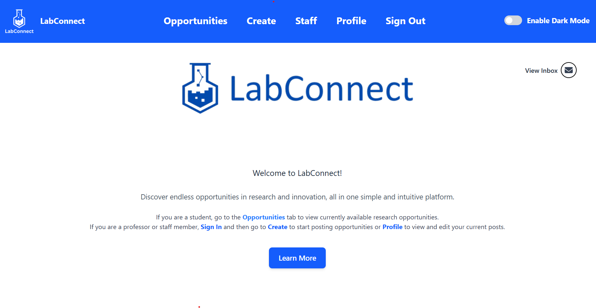
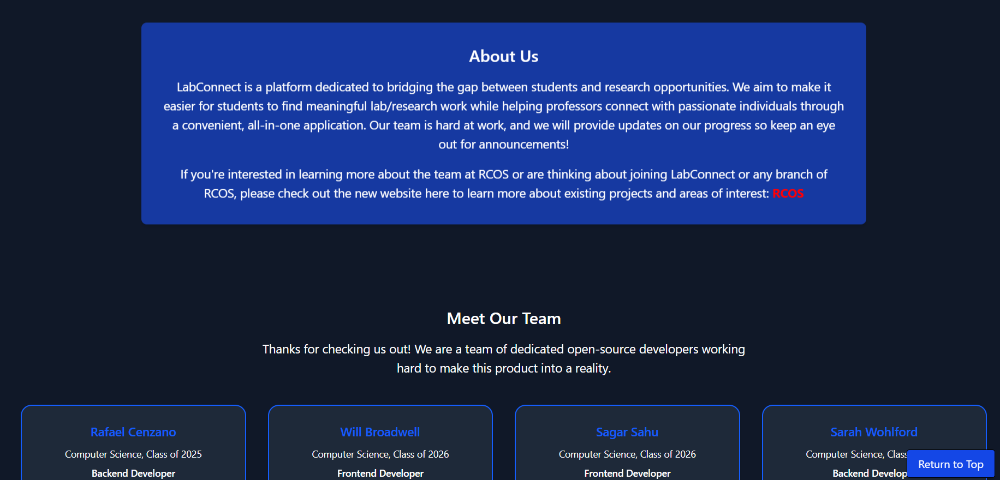

<!-- PROJECT SHIELDS -->

[![Contributors][contributors-shield]][contributors-url]
[![Forks][forks-shield]][forks-url]
[![Issues][issues-shield]][issues-url]
[![Pull Requst][pr-shield]][pr-url]
[![Activity][activity-shield]][activity-url]
[![Stargazers][stars-shield]][stars-url]


<!-- TABLE OF CONTENTS -->
<details>
    <summary> Table of Contents </summary>
    <ol>
        <li>
            <a href="#about"> About the project</a>
            <ul>
                <li><a href="#built-with">Built With</a>
            </ul>
        </li>
        <li>
            <a href="#prerequisites"> Prerequisites</a>
        </li>
        <li>
            <a href="#installation"> Installation</a>
        </li>
    </ol>
</details>


<!-- ABOUT THE PROJECT -->
## About
<div align="center">
    <a href="https://github.com/LabConnect-RCOS/LabConnect-Backend">
<!--  -->
</a>

<br/><br/>

<p align="center">A centralized website to connect RPI undergraduate students with research or lab positions<br>
posted by professors, graduate students, or lab staff.</p>
</div>


### Built With

[![TypeScript][TypeScript]][TypeScript-url]
[![React][React]][React-url]
[![Node.js][Node.js]][Node.js-url]
[![Tailwind CSS][TailwindCSS]][TailwindCSS-url]

### Current Frontend UI



<!-- Getting Started -->
## Prerequisites
 * Clone
    * Clone repo through CLI
        ```bash
        $ git clone https://github.com/LabConnect-RCOS/LabConnect-Frontend.git
        ```
    * or through [Github Desktop](https://desktop.github.com/)
 * Install Node and NPM. Recommend using nvm to manage node versions. The frontend currently uses `Node 22`
    * Mac: 
        ```
        $ brew install nvm
        $ nvm install node
        ```
    * Windows: [here](https://nodejs.org/dist/v22.20.0/node-v22.20.0-x64.msi) 
    * Linux:
        ```
        $ sudo apt install curl
        $ curl -o- https://raw.githubusercontent.com/nvm-sh/nvm/v0.39.7/install.sh | bash
        ```
        Close and reopen terminal then run:
        ```
        $ nvm install node
        ```
 * Install Packages 
    ```
    $ npm install
    ```

### Environment Variables

| Variable Name          | Default Value | Description                                                   |
|------------------------|---------------|---------------------------------------------------------------|
| `VITE_BACKEND_SERVER` | None | URL to the backend server |

* Set the varaible with:
    ```
    $ export VITE_BACKEND_SERVER="http://127.0.0.1:9000"
    ```

## Testing
 * To run the frontend locally run the following:
    ```
    $ npm run dev
    ```
    This command allows editing and autoreloading while making changes
    
### Linting
* Run the linter and fix any lint issues to maintiain code quality and standards
    ```
    make lint
    ```

## Building
  * To build the application use this command to build the static files and test the production version of deploy the files.
    ```
    $ npm run build
    ```

## Deployment
Create PRs to the main branch from your working branch. Make sure your new code is tested and bug free. Upon creating a merge request, a build test will make sure your code is running without errors and safe to merge to main.

## Contact Us
[](https://discord.gg/tsaxCKjYHT)
[](https://rcoslabconnect.atlassian.net/jira/software/projects/CCS/list)

## Project Contributors

Running list of contributors to the LabConnect project:

### Project Lead

- **Will Broadwell** [Project Lead]
- **Rafael Cenzano** [Former Project Lead]

### Rensselaer Center for Open Source Development Team

- **Jaswanth D** [Frontend]
- **Doan N** [Frontend]
- **Pragathi A** [Frontend / Backend]
- **Aniket S** [Backend]

### Past Rensselaer Center for Open Source Development Team

- **Mohammed P** [Backend] (S'25)
- **Sagar S** [Frontend] (S'25)
- **Gowrisankar P** [Frontend] (S'25)
- **Devan P** [Frontend] (S'25)
- **Sidarth E** [Frontend] (F'24,S'25)
- **Sarah W** [Backend] (S'24,F'24,S'25,U'25)
- **Ramzey Y** [Backend] (S'24,F'24)
- **Siddhi W** [Frontend / Backend] (F'23,S'24,F'24)
- **Mrunal A** [Frontend / Backend] (F'23,S'24,F'24)
- **Abid T** [Frontend / Backend] (F'23,S'24)
- **Nelson** [Backend] (S'24)
- **Duy L** [Database Systems] (F'23)
- **Yash K** [Frontend] (F'23)
- **Sam B** [Scraping / Integration] (F'23)


### Special Thanks
We extend our special thanks support and opportunity provided by the RCOS community.

## License

Distributed under the Apache License. See [LICENSE](https://github.com/LabConnect-RCOS/LabConnect-Frontend/blob/main/LICENSE) for more information.

<!-- https://home.aveek.io/GitHub-Profile-Badges/ -->

<!-- LINKS & IMAGES -->
[contributors-shield]: https://img.shields.io/github/contributors/LabConnect-RCOS/LabConnect-Frontend.svg?style=for-the-badge
[contributors-url]: https://github.com/LabConnect-RCOS/LabConnect-Frontend/graphs/contributors
[forks-shield]: https://img.shields.io/github/forks/LabConnect-RCOS/LabConnect-Frontend.svg?style=for-the-badge
[forks-url]: https://github.com/LabConnect-RCOS/LabConnect-Frontend/network/members
[stars-shield]: https://img.shields.io/github/stars/LabConnect-RCOS/LabConnect-Frontend.svg?style=for-the-badge
[stars-url]: https://github.com/LabConnect-RCOS/LabConnect-Frontend/stargazers
[issues-shield]: https://img.shields.io/github/issues/LabConnect-RCOS/LabConnect-Frontend.svg?style=for-the-badge
[issues-url]: https://github.com/LabConnect-RCOS/LabConnect-Frontend/issues
[pr-shield]: https://img.shields.io/github/issues-pr/LabConnect-RCOS/LabConnect-Frontend.svg?style=for-the-badge
[pr-url]: https://github.com/LabConnect-RCOS/LabConnect-Frontend/pulls

[activity-shield]: https://img.shields.io/github/last-commit/LabConnect-RCOS/LabConnect-Frontend?style=for-the-badge
[activity-url]: https://github.com/LabConnect-RCOS/LabConnect-Frontend/activity

[TypeScript]: https://img.shields.io/badge/TypeScript-3178C6?style=for-the-badge&logo=typescript&logoColor=white
[TypeScript-url]: https://www.typescriptlang.org/
[React]: https://img.shields.io/badge/React-61DAFB?style=for-the-badge&logo=react&logoColor=black
[React-url]: https://reactjs.org/
[Node.js]: https://img.shields.io/badge/Node.js-43853D?style=for-the-badge&logo=node.js&logoColor=white
[Node.js-url]: https://nodejs.org/
[TailwindCSS]: https://img.shields.io/badge/Tailwind_CSS-38B2AC?style=for-the-badge&logo=tailwind-css&logoColor=white
[TailwindCSS-url]: https://tailwindcss.com/
